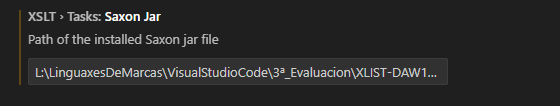

Creamos arquivo xsl co mesmo nome co xml, e unha vez dentro poñemos "<", e seleccionamos 
xsl:stylesheet

Primero instalamos XLST/Xpath 

Pinchamos en comand pallete

logo preferences: open user settings

Logo buscamos xslt, y Saxon Jar e damoslle a ruta pero hay que quitar as comillas,  Metemolo no xslt tasks saxon jar

vamos a terminan y run build task, y luego ejecutamos/configuramos saxonjar 

PAra noemi pon demasiada morrala enton borra cousas, todos os espazos de nomes menos o primeiro aya version="3.0"

Terminal, run configure task, xl transform (new) -- Nada de coger js

Logo dentro de taskt.json, vamos a terminal, run task, e logo pillamos el xml y luego el xslt

Despois create a carpeta xsl-out, co result1.

Modificamos el taskt.json, entonces ahora vamos a resultPath, y le cambia el el json para nose que polla del nombre ${command:xslt-xpath.pickResultFile}, creo que para poder elegir el nombre, y se lo cambio no al js, al otro

Seleccionar siempre el stylesheet

-- como usar el sl 

El sort solo se puede utilizar con apply-templates, o con for-each, por defecto ordenar con ascedente